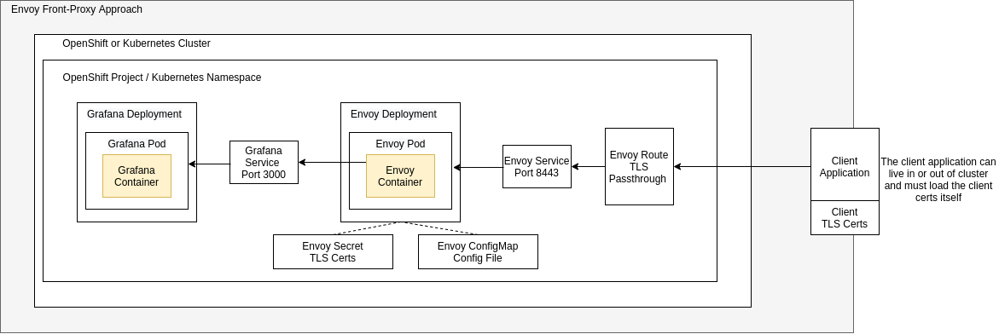

## Purpose
This is an example setup that uses Envoy to proxy requests into a service deployed on OpenShift. Envoy is configured to perform TLS termination AND client verification with self-signed certificates.  This example deploys grafana as the `server` component. 



## Cert Creation

- Create your local CA, Server, and Client certificates
- 
```
mkdir certs; cd certs;

# Server cert generation - Make sure the Common Name matches the desired FQDN of your route / ingress resource
openssl req -newkey rsa:4096 -keyform PEM -keyout ca.key -x509 -days 3650 -outform PEM -out ca.crt
openssl genrsa -out server.key 4096
openssl req -new -key server.key -out server.req -sha256
openssl x509 -req -in server.req -CA ca.crt -CAkey ca.key -set_serial 100 -extensions server -days 1460 -outform PEM -out server.crt -sha256
rm server.req

# Client cert Generation
openssl genrsa -out client.key 4096
openssl req -new -key client.key -out client.req
openssl x509 -req -in client.req -CA ca.crt -CAkey ca.key -set_serial 101 -extensions client -days 365 -outform PEM -out client.crt
rm client.req 

# For browser testing, convert to p12 if you like and import into your browser
openssl pkcs12 -export -inkey client.key -in client.crt -out client.p12
```

## OpenShift / Kubernetes Deployment

- Create Secret for the Envoy server

```
oc create secret generic envoy-certs --from-file=ca.crt=ca.crt --from-file=server.crt=server.crt --from-file=server.key=server.key
cd ..
```

- Update `deploy/envoy-configmap.yaml` as necessary; ie. Modify the `clusters` section to reference the desired back-end service
- Create deployment artifacts (use `kubectl` if deploying to k8s)

```
oc apply -f deploy/
```


- Test access with cURL

```
curl https://[route-name]/ --cacert certs/ca.crt --key certs/client.key  --cert certs/client.crt
```

## Helpful Resources
- [https://www.makethenmakeinstall.com/2014/05/ssl-client-authentication-step-by-step/](https://www.makethenmakeinstall.com/2014/05/ssl-client-authentication-step-by-step/)
- [https://www.envoyproxy.io/learn/front-proxy](https://www.envoyproxy.io/learn/front-proxy)