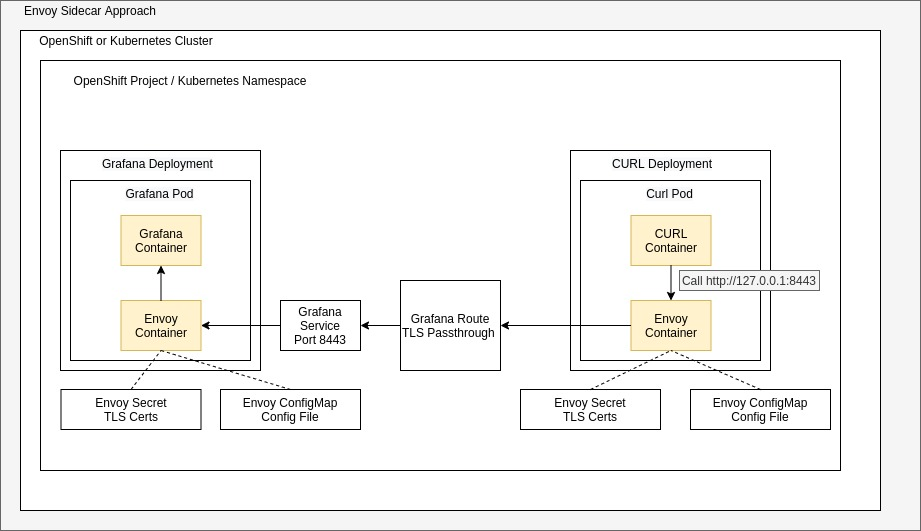

## Purpose

This is an example setup that uses Envoy to proxy requests into a service deployed on OpenShift. Envoy is configured to perform TLS termination AND client verification with self-signed certificates.  This example uses grafana as the server, and curl as the client, with envoy handling all of the TLS configuration. 



At a high-level, an envoy container can be added to the pod spec in a deployment. This container should contain the appropriate TLS certificates as well as an envoy config to handle the desired routing pattern. The following is an example of the container configuration: 

```
        - name: envoy
          image: envoyproxy/envoy-alpine:v1.14-latest
          args: ["-c", "/etc/envoy.yaml", "--service-cluster", "$(POD_NAME)"]
          env:
          - name: POD_NAME
            valueFrom:
              fieldRef:
                fieldPath: metadata.name
          volumeMounts:
          - name: envoy-yaml
            mountPath: /etc/envoy.yaml
            subPath: envoy.yaml
          - name: envoy-server-certs
            mountPath: /etc/envoy/certs
```


## Cert Creation

- Create your local CA, Server, and Client certificates

```
mkdir certs; cd certs;

# Server cert generation - Make sure the Common Name matches the desired FQDN of your route / ingress resource
openssl req -newkey rsa:4096 -keyform PEM -keyout ca.key -x509 -days 3650 -outform PEM -out ca.crt
openssl genrsa -out server.key 4096
openssl req -new -key server.key -out server.req -sha256
openssl x509 -req -in server.req -CA ca.crt -CAkey ca.key -set_serial 100 -extensions server -days 1460 -outform PEM -out server.crt -sha256
rm server.req

# Client cert Generation
openssl genrsa -out client.key 4096
openssl req -new -key client.key -out client.req
openssl x509 -req -in client.req -CA ca.crt -CAkey ca.key -set_serial 101 -extensions client -days 365 -outform PEM -out client.crt
rm client.req 

# For browser testing, convert to p12 if you like and import into your browser
openssl pkcs12 -export -inkey client.key -in client.crt -out client.p12
```


## OpenShift / Kubernetes Deployment

- Create Secret for sever and client secrets for the envoy sidecars

```
oc create secret generic envoy-server-certs --from-file=ca.crt=ca.crt --from-file=server.crt=server.crt --from-file=server.key=server.key
oc create secret generic envoy-client-certs --from-file=ca.crt=ca.crt --from-file=client.crt=client.crt --from-file=client.key=client.key
cd ..
```

- Adjust the client envoy configmap `deploy/curl/curl-configmap.yam` to reflect the appropriate grafana (server) route
- Deploy the grafana (server) and curl (client) configs
```
oc apply -f deploy/grafana/
oc apply -f deploy/curl/
```

- From the curl pod, test access to the grafana instance by calling the envoy listener. Envoy will then pick up the call and forward it on to the grafana enpoint with the appropriate SSL certificates. 
```
oc rsh -c curl [curl pod name]
curl http://127.0.0.1:8443
```

